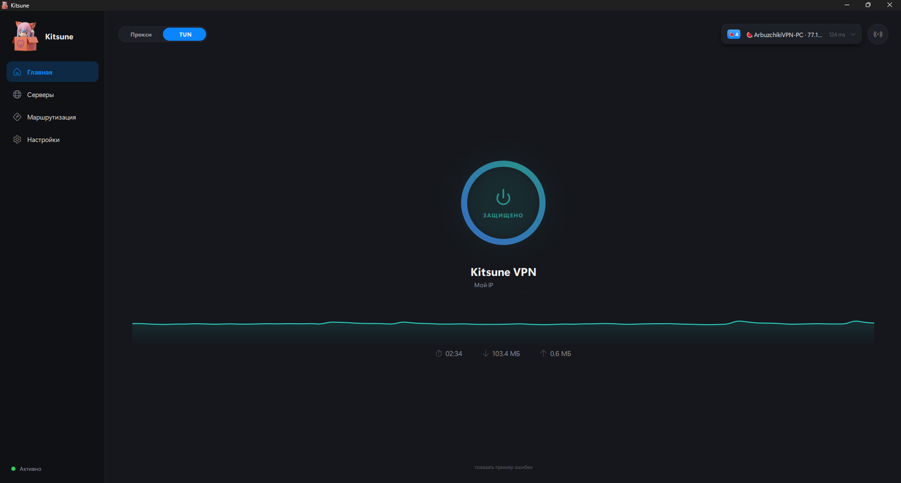

<div align="center">


# Kitsune

**A Windows VPN client that doesn't get in your way.**

[](https://github.com/SagerNet/sing-box)
[](https://doc.qt.io/qtforpython-6/)
[](#)
[](#license)

</div>

<br>

<div align="center">



</div>

<br>

> Built on top of [sing-box](https://github.com/SagerNet/sing-box) — the same battle-tested core
> used by major VPN clients. The kernel does the heavy lifting; we make it pleasant to use.

---

## What's inside

<table>
<tr>
<td valign="top" width="50%">

#### 🌐 &nbsp;Protocols

- **VLESS** &middot; Reality, Vision flow, PQC encryption (`mlkem768`)
- **VMess** &middot; classic + AEAD
- **Trojan** &middot; TLS / Reality
- **Shadowsocks** &middot; AEAD + 2022 ciphers
- **WireGuard** &middot; 1.13 endpoint schema
- **Transports** &middot; tcp / ws / grpc / httpupgrade / **xhttp**

#### 🧭 &nbsp;Routing

- **TUN mode** &middot; system-wide capture with `auto_route`
- **Proxy mode** &middot; SOCKS + HTTP on one mixed inbound
- **Per-app rules** &middot; 3-state toggle (Auto / VPN / Direct) for any installed exe
- **Profiles** &middot; named snapshots, switch in one click
- **Rules import** &middot; paste sing-box JSON or Clash YAML
- **Bundled rule-sets** &middot; offline-ready (`geosite-ru`, `geoip-ru`, ads block)

</td>
<td valign="top" width="50%">

#### 🛡️ &nbsp;Safety

- **Kill-switch** &middot; Windows Firewall blocks all outbound on drop
- **Auto-reconnect** &middot; 5-attempt watchdog with intent detection
- **Health-check** &middot; every server validated by `sing-box check`
- **Leak-aware DNS** &middot; hijack-dns + remote DoH via tunnel
- **No leftovers** &middot; targeted cleanup on start (only our own settings)

#### ✨ &nbsp;Quality of life

- **Seamless server switch** &middot; selector outbound + Clash API, no reconnect
- **Subscriptions** &middot; base64 / plain, background validation, favorites preserved
- **Auto-update** &middot; sing-box core checked silently, manual button in Settings
- **Logs panel** &middot; live core stdout, hidden by default
- **System tray** &middot; animated icon, quick connect, server switcher
- **Global hotkey** &middot; toggle VPN even when minimized
- **Bilingual** &middot; full RU / EN, switch on the fly

</td>
</tr>
</table>

---

## Install

#### Easy way

Download `KitsuneSetup.exe` from [Releases](../../releases), run, follow the wizard.
Installs per-user into `%LocalAppData%\Programs\Kitsune` — **no admin rights required**.
The installer detects your Windows language and offers RU/EN mode.

#### Portable way

Download `Kitsune-portable.zip`, unpack anywhere, run `Kitsune.exe`. That's it.
No registry writes outside of the Windows Run key (only if you enable autostart yourself).

> **TUN mode requires admin** — the app requests UAC elevation when you first connect
> in TUN mode. Proxy mode works fine without admin.

---

## Quick start

1. Open the app, switch to **Servers**.
2. Paste a `vless://` / `vmess://` / `trojan://` / `ss://` link with **Paste from clipboard**,
   or open **+ Subscription** and add your subscription URL.
3. Pick a server, hit the big connect ring on the **Dashboard**. Done.

---

## Why another VPN client?

Most Windows VPN clients are either ugly (`v2rayN`), heavy (Electron-based ~150 MB+),
or locked to a single configuration that's hard to bend. Kitsune trades nothing:

- Native **PySide6 + QML** &mdash; instant startup, real OS integration, no Chromium overhead.
- **Same routing engine** as the big players &mdash; full protocol coverage of sing-box.
- **No telemetry. No accounts. No ads.** Bring your own server, keep your traffic.

---

## Architecture

```
qml/App/    — UI (PySide6 + QtQuick.Controls.Basic)
app.py      — Backend (state machine, slots, signals, system glue)
engine.py   — sing-box wrapper (config-gen, Core lifecycle, Clash API)
core/       — sing-box binaries + bundled rule-sets
assets/     — icon and tray frames
```

The Backend is a single `QObject` with ~50 slots exposed to QML and full thread-safe
signal plumbing. HTTP calls, app scanning, server validation — all run in background
threads; results delivered via queued signals.

---

## Build from source

Requires Python 3.11+ and PySide6.

```bash
git clone https://github.com/Tawreos228/KitsuneVPN
cd KitsuneVPN
python -m pip install PySide6 segno Pillow pyinstaller
python core/fetch_core.py        # downloads official sing-box.exe
python app.py                    # run in dev mode
```

**Build distributable:**

```bash
python -m PyInstaller kitsune.spec --noconfirm   # → dist/Kitsune/
iscc.exe installer.iss                            # → dist_installer/KitsuneSetup.exe
```

The `.spec` aggressively excludes unused Qt modules (drops ~260 MB from the bundle,
notably `Qt6WebEngineCore.dll`).

---

## What's not here

Being honest about scope:

- **Windows only.** No macOS/Linux/mobile builds. The engine is cross-platform but the
  UAC, system proxy, and firewall integration is Windows-specific.
- **No built-in server store.** Bring your own VLESS/VMess/etc. servers.
- **Some exotic protocols** (mieru, juicity, AmneziaWG with custom obfuscation) need
  more work on the UI side and aren't exposed yet.
- **The exe is not code-signed.** Windows SmartScreen will warn on first run — click
  "More info → Run anyway". A signed release is on the roadmap.

---

## Feedback & contributing

This is an actively developing project &mdash; expect rough edges. **All feedback is welcome:**

- 🐞 &nbsp; **Something broken?** &mdash; [open a bug report](../../issues/new?template=bug_report.md).
  Include your Windows version, what you did, what happened, and what you expected.
- 🤔 &nbsp; **Something behaves weirdly?** &mdash; tell us. Even if it's "this dialog felt
  awkward", that's useful. UX papercuts are real bugs.
- 💡 &nbsp; **Want a feature?** &mdash; [request it](../../issues/new?template=feature_request.md).
  Protocol you'd like supported, workflow that's missing, integration ideas &mdash; all on the table.
- 🌍 &nbsp; **Translation help** &mdash; the i18n dictionary lives in `qml/App/T.qml`.
  Adding a new language is straightforward (one new entry in the `dict` object).
- 🔧 &nbsp; **Pull requests** are welcome. For non-trivial changes, please open an issue
  first so we can agree on the direction before you spend time.

If your VPN setup is unusual (atypical subscription format, custom protocol, exotic
routing scenario), we'd especially love to hear about it &mdash; that's how the
exotic-protocols list shortens.

---

## License

MIT. Use it, fork it, ship it. The sing-box engine carries its own license — see its repo.

---

<br>

<details>
<summary><i>One more thing…</i></summary>

<br>

There's a hidden theme. Try tapping the fox in the sidebar five times. 🦊

</details>
